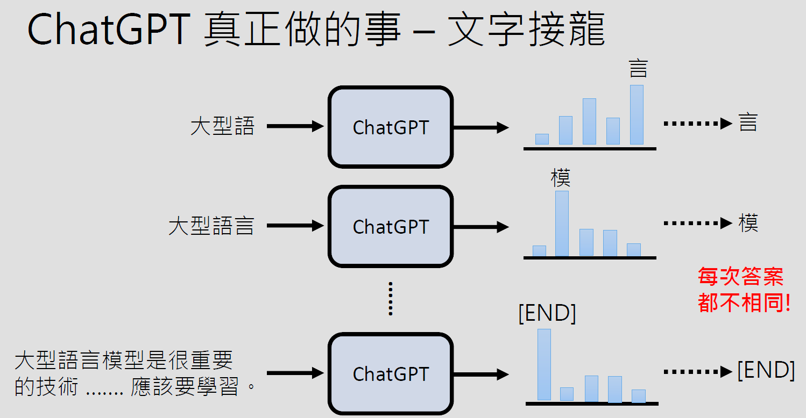
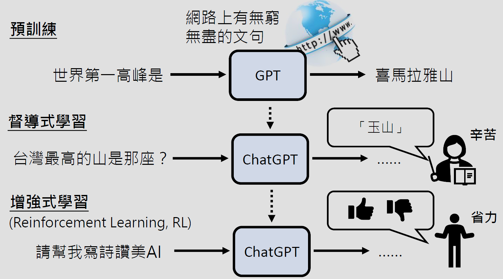

- [About the Class](#about-the-class)
- [Syllabus](#syllabus)
- [Key Takeaways](#key-takeaways)
  - [Lecture 1：课程概述](#lecture-1课程概述)
    - [80分钟快速了解大型语言模型](#80分钟快速了解大型语言模型)
  - [Lecture 2: 提示工程\&AI代理人](#lecture-2-提示工程ai代理人)
  - [Lecture 3: 生成策略\&从专才到通才](#lecture-3-生成策略从专才到通才)
- [References](#references)

# About the Class

- 这门课不是教你如何使用ChatGPT，而是帮助你了解ChatGPT之类生成式AI背后的原理及未来发展和可能性。
- 不需要预修其他课程。
- 可以作为学习人工智能的第一门课，因此无法深入提到所有技术，如果想要更深入研究，推荐阅读PPT中引用的论文。（上课引用论文多数来自[Self-Supervised Speech Representation Learning: A Review](https://arxiv.org/abs/2205.10643)）
- 作业难度分为三个等级，分别是：
  - :white_check_mark: (送分) 
  - :heavy_exclamation_mark:（如果不在意分数可以在短时间内完成）
  - :bangbang:（至少需要数小时）

# Syllabus

| Date | Topic | Slides |  Extra Materials | Presentation | Homework |
| -------- | ------- | -------- | ------- | -------- | -------- |
| 02/23 | **课程概述**   [[课程说明]](https://youtu.be/AVIKFXLCPY8)   [[课程规则]](https://youtu.be/vCxyd_S4R24)    [[第1讲：生成式AI是什么？]](https://youtu.be/JGtqpQXfJis) |  1. [课程内容说明](./slides/01/0223_course.pdf)   2. [什么是生成式人工智能？](./slides/01/0223_universal.pdf)   3. [今日的生成式人工智能厉害在哪里](./slides/01/0223_intro_gai.pdf) | [80分钟快速了解大型语言模型](https://youtu.be/wG8-IUtqu-s?si=-YWWLqbeX7wiRQ4M)   [[slide]](./slides/01/LLM_80min%20(v5).pdf) |  | 真假难辨的世界 :white_check_mark:   [[video]](https://www.youtube.com/watch?v=QOrtPUxaIG8) [[pdf]](./assignments/HW1/GenAI%20HW1%20slides.pdf) |
| 03/01 | **提示工程&AI代理人**   [[第2讲：今日的生成式人工智能厉害在哪里？]](https://youtu.be/glBhOQ1_RkE)   [[第3讲：训练不了人工智能吗？你可以训练你自己（上）]](https://youtu.be/A3Yx35KrSN0) | 1. [今日的生成式人工智能](./slides/02/0301_universal.pdf)   2. [prompt engineering](./slides/02/0301_prompt_part1.pdf) | [Prompt Engineering Guide](https://www.promptingguide.ai/) | | 都是AI的作文比赛 :white_check_mark:   [[video]](https://www.youtube.com/watch?v=MLvfqvEuINk) [[pdf]](./assignments/HW2/GenAI2024%20HW2.pdf) | 
| 03/08 | **生成策略&从专才到通才**   [[第4讲：训练不了人工智能？你可以训练你自己（中）]](https://youtu.be/lwe3_x50_uw) | [prompt part 2](./slides/03/0308_prompt_part2.pdf) | [语言模型如何学习使用工具](https://youtu.be/ZID220t_MpI)   [[pdf]](./slides/03/NewBing%20(v4).pdf) | | 以AI搭建自己的应用 :heavy_exclamation_mark:   [[video]](https://youtu.be/mQb5Zbbm_T8?si=8M8YOuV7QY1vojig) [[pdf]](./assignments/HW3/GenAI_HW3.pdf) | 
| 03/15 | 生成策略&从专才到通才 | ||  MTK团队演讲 |  |
| 03/22 | 深度学习&Transformer | | |  | 成为AI催眠大师 :heavy_exclamation_mark:  |
| 03/29 | 深度学习&Transformer | | | NVIDIA团队演讲 | 训练自己的语言模型 :bangbang: |
| 04/12 | 评估生成式AI&道德议题 | | | | AI透过人类的回馈学习 :heavy_exclamation_mark: | 
| 04/26 | 打造生成式AI经验谈 | | | TAIDE团队演讲 | |
| 05/03 | 生成式AI的可解释性 | | | | 了解生成式AI在想什么 :heavy_exclamation_mark: |
| 05/10 | 语音的生成式AI  | | | | 生成式AI的安全性议题 :heavy_exclamation_mark: |
| 05/17 | 语音的生成式AI | | | | 演讲影片快速摘要 :heavy_exclamation_mark: |
| 05/24 | 影像的生成式AI | | | MTK团队演讲 | |
| 05/31 | 影像的生成式AI | | | | 定制化自己的影像生成AI :bangbang: |

# Key Takeaways

## Lecture 1：课程概述

- `生成式AI`：是人工智能的一个子集，目标是使得机器产生复杂有结构的物件（能够产生在训练时从来没有看过的东西），比如，写作一篇文章，画一幅画。如今的生成式AI通常采用**深度学习**（e.g. Transformer）来完成任务。
- `机器学习`：机器自动从资料中找到一个函数来拟合。
- `生成式问答`：生成式AI的案例之一。把任务拆解成一连串的文字接龙，一个字接一个字地产生，即`语言模型`。 

### 80分钟快速了解大型语言模型

- **ChatGPT**：由OpenAI开发的大型语言模型
  - `G`: Generative 生成
  - `P`: Pre-trained 预训练
  - `T`: Transformer
- ChatGPT的本质就是做`文字接龙`。

- 为什么不每次都选机率最大的token作为接下去的词呢？因为效果不一定好，很可能会不断重复一样的内容 —— [[The Curious Case of Neural Text Degeneration]](https://arxiv.org/abs/1904.09751)
- 有预训练后，督导式学习不用大量资料。在多种语言上做预训练后，只要教某一个语言的某一个任务，自动学会其他语言的同样任务。

- 如何更好地使用ChatGPT？
  - 把需求讲清楚
  - 提供资讯给ChatGPT
  - 提供范例
  - 鼓励ChatGPT想一想
  - 如何找出神奇咒语
    - 通过强化学习找出有效prompt [[Learning to Generate Prompts for Dialogue Generation through Reinforcement Learning]](https://arxiv.org/abs/2206.03931)
    - [Large Language Models as Optimizers](https://arxiv.org/abs/2309.03409)
  - 可以上传资料，e.g.，图片，PPT等。
  - 调用ChatGPT插件
  - 帮助ChatGPT拆解任务
  - 引导ChatGPT自主进行规划，把任务拆解成小任务
  - ChatGPT其实是会反省的，e.g.，`请检查上述资讯是否正确`
  - 跟真实环境互动

## Lecture 2: 提示工程&AI代理人

- 今日的生成式人工智能
  - 不是`专才`（专用工具，比如翻译软件等），而是`通才`，即不限定能力，由使用者提出问题或要求。
  - 但是如何评估模型的能力并不容易，因为使用者的要求千奇百怪，同一种要求可以有截然不同的解法。
- 如何适应生成式人工智能时代？
  - **给更清楚的指令，提供额外资讯**（`Prompt Engineering`）
    - 神奇咒语
      - 让模型思考 Chain of Thought：`Let's think step by step` [[Large Language Models Are Human-Level Prompt Engineers]](https://arxiv.org/abs/2211.01910)
      - 对模型进行情绪勒索 `This is very important to me` [[Large Language Models Understand and Can be Enhanced by Emotional Stimuli]](https://arxiv.org/abs/2307.11760)
      - 其他 [[Principled Instructions Are All You Need for Questioning LLaMA-1/2, GPT-3.5/4]](https://arxiv.org/abs/2312.16171)
      - 用AI来找神奇咒语 Reinforcement Learning
        - [[Learning to Generate Prompts for Dialogue Generation through Reinforcement Learning]](https://arxiv.org/abs/2206.03931)
        - [[Large Language Models Are Human-Level Prompt Engineers]](https://arxiv.org/abs/2211.01910)
    - 提供额外资讯
      - 把前提讲清楚
      - 提供生成式AI不清楚的资讯
      - 提供范例 
        - [[Language Models are Few-Shot Learners]](https://arxiv.org/abs/2005.14165)
        - [[Rethinking the Role of Demonstrations: What Makes In-Context Learning Work?]](https://arxiv.org/abs/2202.12837)
        - [[Larger language models do in-context learning differently]](https://arxiv.org/abs/2303.03846) 最强的模型真的部分读懂了范例
    - 把任务分成多步骤来解 [[Re3: Generating Longer Stories With Recursive Reprompting and Revision]](https://arxiv.org/abs/2210.06774)
      - 让模型检查自己的答案 [[Constitutional AI: Harmlessness from AI Feedback]](https://arxiv.org/abs/2212.08073)
      - 同一个答案每次答案都不同 [[Self-Consistency Improves Chain of Thought Reasoning in Language Models]](https://arxiv.org/abs/2203.11171)
      - 打一套组合拳
        - [[Tree of Thoughts: Deliberate Problem Solving with Large Language Models]](https://arxiv.org/abs/2305.10601)
        - [[Algorithm of Thoughts: Enhancing Exploration of Ideas in Large Language Models]](https://arxiv.org/abs/2308.10379)
        - [[Graph of Thoughts: Solving Elaborate Problems with Large Language Models]](https://arxiv.org/abs/2308.09687)
  - **训练自己的模型：使用开源模型（e.g., LLaMA），微调** [[Examining Forgetting in Continual Pre-training of Aligned Large Language Models]](https://arxiv.org/abs/2401.03129)

## Lecture 3: 生成策略&从专才到通才

- 拆解任务
  - 为什么让模型思考（Chain of Thought, CoT）会有用
    - 先详细列式，再给出答案
    - 新版本AI本身就会拆解任务，因此CoT对新版本的提升效果很有限
- 语言模型检查自己的错误，即语言模型有自我反省的能力
  - 检查结果比较简单
  - 反省过程中没有任何模型被训练，如果再重新提问一次，不会得到反省后的答案
- 为什么同一个问题每次答案都不同？
  - 语言模型输出的是概率分布
- 使用工具去让语言模型做不擅长的事情
  - 搜索引擎 Retrieval Augmented Generation (RAG)
  - 调用代码工具 [[Program of Thoughts Prompting: Disentangling Computation from Reasoning for Numerical Reasoning Tasks]](https://arxiv.org/abs/2211.12588)
  - 文字生图AI（DALL-E）
  - 其他ChatGPT Plugins
- 各种技巧加起来打一套组合拳 [[AnyTool: Self-Reflective, Hierarchical Agents for Large-Scale API Calls]](https://arxiv.org/abs/2402.04253) 

# References

> 包括课程或讲座中提到的论文。

- 讲座：[AI時代，你跟上了嗎？｜李宏毅｜人文講堂](https://www.youtube.com/watch?v=iqaiPyvDD4Y)
- [Self-Supervised Speech Representation Learning: A Review](https://arxiv.org/abs/2205.10643)
- [The Curious Case of Neural Text Degeneration](https://arxiv.org/abs/1904.09751)
- [Training language models to follow instructions with human feedback](https://arxiv.org/abs/2203.02155)
- [Large Language Models are Zero-Shot Reasoners](https://arxiv.org/abs/2205.11916) 
- [Re3: Generating Longer Stories With Recursive Reprompting and Revision](https://arxiv.org/abs/2210.06774) 如何引导LLM来写长篇小说
- [Constitutional AI: Harmlessness from AI Feedback](https://arxiv.org/abs/2212.08073) 要求LLM自我反省其回答是否无害
- [DERA: Enhancing Large Language Model Completions with Dialog-Enabled Resolving Agents](https://arxiv.org/abs/2303.17071) 两个LLM彼此给对方的回答挑错，以此提升回答质量
- [Language Models as Zero-Shot Planners: Extracting Actionable Knowledge for Embodied Agents](https://arxiv.org/abs/2201.07207) 如何让LLM跟真实环境互动
- [Inner Monologue: Embodied Reasoning through Planning with Language Models](https://innermonologue.github.io/)
- [Language Models are Few-Shot Learners](https://arxiv.org/abs/2005.14165) In-context learning
- [Larger language models do in-context learning differently](https://arxiv.org/abs/2303.03846) 模型可以读懂范例吗？