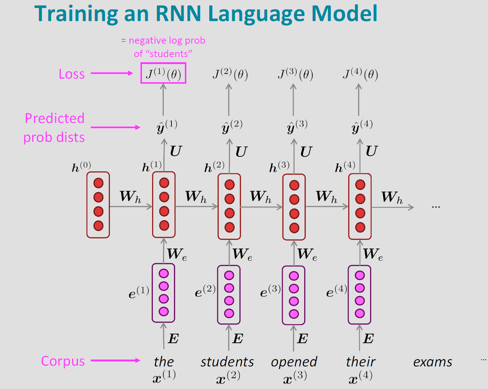
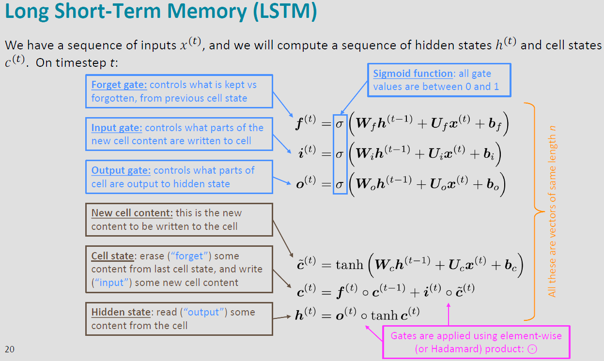
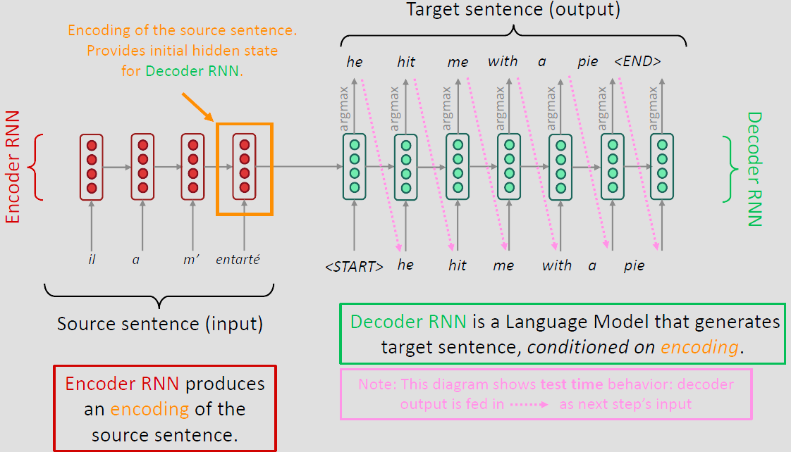
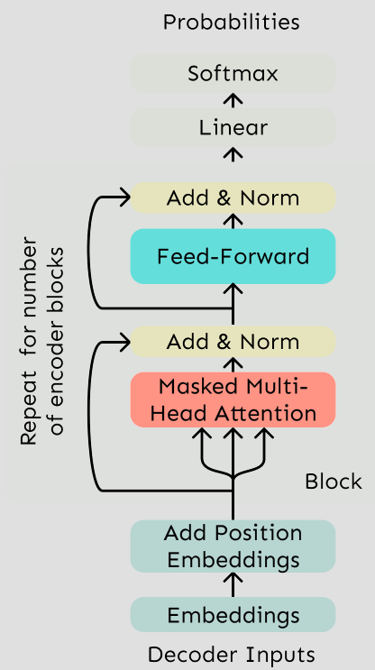
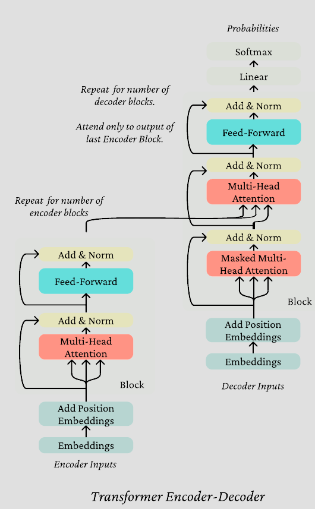
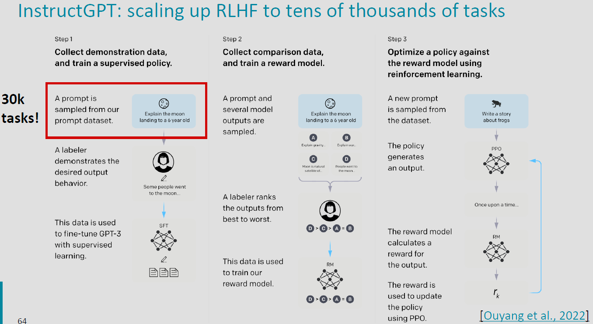
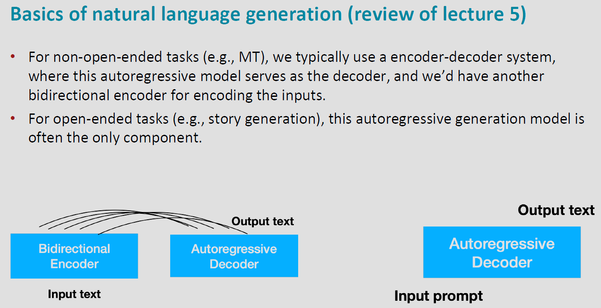
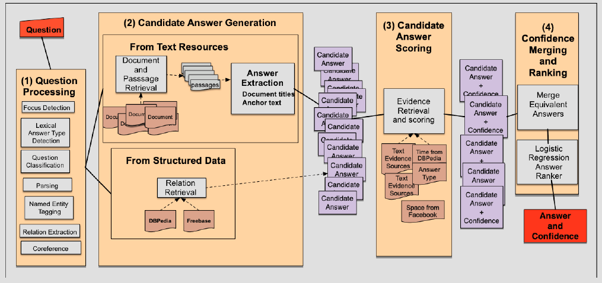

# CS224N: Natural Language Processing with Deep Learning

[Course Homepage](https://web.stanford.edu/class/archive/cs/cs224n/cs224n.1234/) [[course videos]](https://www.youtube.com/watch?v=rmVRLeJRkl4&list=PLoROMvodv4rOSH4v6133s9LFPRHjEmbmJ)

**Scope**

- The foundations of the effective modern methods for deep learning applied to NLP
  - Basics first, then key methods used in NLP in 2023: `Word vectors`, `feed-forward networks`, `recurrent networks`, `attention`, `encoder-decoder models`, `transformers`, `large pre-trained language models`, etc.
- A big picture understanding of human languages and the difficulties in understanding and producing them via computers
- An understanding of and **ability to build systems** (in Pytorch) for some of the major problems in NLP
  - Word meaning, dependency parsing, machine translation, question answering

 

**A few uses of NLP**

- *Machine Translation*.  
  - Perhaps one of the earliest and most successful applications and driving uses of natural language processing.
- *Question answering and information retrieval*.  
  - In NLP, question answering has tended to be related to information-seeking questions. 
- *Summarization and analysis of text*.  
  - There are myriad reasons to want to understand (1) what people are talking about and (2) what they think about those things. 
- *speech(or sign)-to-text*.  
  - The process of automatic transcription of spoken or signed language (audio or video) to textual representations is a massive and useful application.

 

**High-Level Plan for Assignments**

- Ass1 is hopefully an easy on ramp - A Jupyter/IPython Notebook
- Ass2 is pure Python (numpy) but expects you to do (multivariate) calculus, so you really understand the basics
- Ass3 introduces PyTorch, building a feed-forward network for dependency parsing
- Ass4 and Ass5 use PyTorch on a GPU (Microsoft Azure)
- For Final Project
  - Do the default project, which is a question answering system
  - Propose a custom final project

  

Lecture | Topics | Course Materials | Assignments |
| --------- | --------- | --------- | --------- |
| **Lecture 1** | **Word Vectors**   [[slides]](https://web.stanford.edu/class/archive/cs/cs224n/cs224n.1234/slides/cs224n-2023-lecture01-wordvecs1.pdf) [[notes]](https://web.stanford.edu/class/archive/cs/cs224n/cs224n.1234/readings/cs224n_winter2023_lecture1_notes_draft.pdf)      **Gensim word vectors**   [[code]](https://web.stanford.edu/class/archive/cs/cs224n/cs224n.1234/materials/Gensim%20word%20vector%20visualization.html) | Suggested Readings:   1. [Efficient Estimation of Word Representations in Vector Space](http://arxiv.org/pdf/1301.3781.pdf) (original word2vec paper)   2. [Distributed Representations of Words and Phrases and their Compositionality](http://papers.nips.cc/paper/5021-distributed-representations-of-words-and-phrases-and-their-compositionality.pdf) (negative sampling paper) | Assignment 1   [[code]](./assignments/assignment1) |
| **Lecture 2** | **Word Vectors, Word Window CLassification, Language Models**   [[slides]](https://web.stanford.edu/class/archive/cs/cs224n/cs224n.1234/slides/cs224n-2023-lecture02-wordvecs2.pdf) [[notes]](https://web.stanford.edu/class/archive/cs/cs224n/cs224n.1234/readings/cs224n-2019-notes02-wordvecs2.pdf)  | Suggested Readings:   1. [GloVe: Global Vectors for Word Representation](http://nlp.stanford.edu/pubs/glove.pdf) (original GloVe paper)   2. [Improving Distributional Similarity with Lessons Learned from Word Embeddings](http://www.aclweb.org/anthology/Q15-1016)   3. [Evaluation methods for unsupervised word embeddings](http://www.aclweb.org/anthology/D15-1036)    Additional Readings:   1. [A Latent Variable Model Approach to PMI-based Word Embeddings](http://aclweb.org/anthology/Q16-1028)   2. [Linear Algebraic Structure of Word Senses, with Applications to Polysemy](https://transacl.org/ojs/index.php/tacl/article/viewFile/1346/320)   [On the Dimensionality of Word Embedding](https://papers.nips.cc/paper/7368-on-the-dimensionality-of-word-embedding.pdf)  |  |
| **Lecture 3** | **Backprop and Neural Networks**   [[slides]](https://web.stanford.edu/class/archive/cs/cs224n/cs224n.1234/slides/cs224n-2023-lecture03-neuralnets.pdf) [[notes]](https://web.stanford.edu/class/archive/cs/cs224n/cs224n.1234/readings/cs224n-2019-notes03-neuralnets.pdf) | Suggested Readings:   1. [matrix calculus notes](https://web.stanford.edu/class/archive/cs/cs224n/cs224n.1234/readings/gradient-notes.pdf)   2. [Review of differential calculus](https://web.stanford.edu/class/archive/cs/cs224n/cs224n.1234/readings/review-differential-calculus.pdf)   3. [CS231n notes on network architectures](http://cs231n.github.io/neural-networks-1/) :thumbsup:   4. [CS231n notes on backprop](http://cs231n.github.io/optimization-2/) :thumbsup:   5. [Derivatives, Backpropagation, and Vectorization](http://cs231n.stanford.edu/handouts/derivatives.pdf)   6. [Learning Representations by Backpropagating Errors](http://www.iro.umontreal.ca/~vincentp/ift3395/lectures/backprop_old.pdf) (seminal Rumelhart et al. backpropagation paper)    Additional Readings:   1. [Yes you should understand backprop](https://medium.com/@karpathy/yes-you-should-understand-backprop-e2f06eab496b)   2. [Natural Language Processing (Almost) from Scratch](http://www.jmlr.org/papers/volume12/collobert11a/collobert11a.pdf) | Assignment 2   [[code]](./assignments/assignment2/) [[handout]](./assignments/assignment2/assignment2.pdf) |
| **Lecture 4** | **Dependency Parsing**   [[slides](https://web.stanford.edu/class/archive/cs/cs224n/cs224n.1234/slides/cs224n-2023-lecture04-dep-parsing.pdf)] [[notes]](https://web.stanford.edu/class/archive/cs/cs224n/cs224n.1234/readings/cs224n-2019-notes04-dependencyparsing.pdf)   [[slides (annotated)]](https://web.stanford.edu/class/archive/cs/cs224n/cs224n.1234/slides/cs224n-2021-lecture04-dep-parsing-annotated.pdf) | Suggested Readings:   1. [Incrementality in Deterministic Dependency Parsing](https://www.aclweb.org/anthology/W/W04/W04-0308.pdf)   2. [A Fast and Accurate Dependency Parser using Neural Networks](https://www.emnlp2014.org/papers/pdf/EMNLP2014082.pdf)   3. [Dependency Parsing](http://www.morganclaypool.com/doi/abs/10.2200/S00169ED1V01Y200901HLT002)   4. [Globally Normalized Transition-Based Neural Networks](https://arxiv.org/pdf/1603.06042.pdf)   5. [Universal Stanford Dependencies: A cross-linguistic typology](http://nlp.stanford.edu/~manning/papers/USD_LREC14_UD_revision.pdf)   6. [Universal Dependencies website](http://universaldependencies.org/)   7. [Jurafsky & Martin Chapter 14](https://web.stanford.edu/~jurafsky/slp3/14.pdf)|  | 
| **Lecture 5** | **Recurrent Neural Networks and Language Models**   [[slides]](https://web.stanford.edu/class/archive/cs/cs224n/cs224n.1234/slides/cs224n-2023-lecture05-rnnlm.pdf) [[notes]](https://web.stanford.edu/class/archive/cs/cs224n/cs224n.1234/readings/cs224n-2019-notes05-LM_RNN.pdf) | Suggested Readings:   1. [N-gram Language Models](https://web.stanford.edu/~jurafsky/slp3/3.pdf) (textbook chapter)   2. [The Unreasonable Effectiveness of Recurrent Neural Networks](http://karpathy.github.io/2015/05/21/rnn-effectiveness/) (blog post overview) :thumbsup:   3. [Sequence Modeling: Recurrent and Recursive Neural Nets](http://www.deeplearningbook.org/contents/rnn.html) (Sections 10.1 and 10.2)   4. [On Chomsky and the Two Cultures of Statistical Learning](http://norvig.com/chomsky.html)   5. [Sequence Modeling: Recurrent and Recursive Neural Nets](http://www.deeplearningbook.org/contents/rnn.html) (Sections 10.3, 10.5, 10.7-10.12)    6. [Learning long-term dependencies with gradient descent is difficult](http://www.comp.hkbu.edu.hk/~markus/teaching/comp7650/tnn-94-gradient.pdf) (one of the original vanishing gradient papers)   7. [On the difficulty of training Recurrent Neural Networks](https://arxiv.org/pdf/1211.5063.pdf)(proof of vanishing gradient problem)   8. [Vanishing Gradients Jupyter Notebook](https://web.stanford.edu/class/archive/cs/cs224n/cs224n.1174/lectures/vanishing_grad_example.html) (demo for feedforward networks) :thumbsup:   9. [Understanding LSTM Networks](http://colah.github.io/posts/2015-08-Understanding-LSTMs/) (blog post overview) | Assignment 3   [[code]](./assignments/assignment3/) [[handout]](./assignments/assignment3/a3_handout.pdf) |
| **Lecture 6** | **Seq2Seq, MT, Subword Models**   [[slides]](https://web.stanford.edu/class/archive/cs/cs224n/cs224n.1234/slides/cs224n-2023-lecture06-fancy-rnn.pdf) [[notes]](https://web.stanford.edu/class/archive/cs/cs224n/cs224n.1234/readings/cs224n-2019-notes05-LM_RNN.pdf) | Suggested Readings:   1. [Statistical Machine Translation Slides, CS224n 2015](https://web.stanford.edu/class/archive/cs/cs224n/cs224n.1162/syllabus.shtml) (lectures 2/3/4)   2. [Statistical Machine Translation](https://www.cambridge.org/core/books/statistical-machine-translation/94EADF9F680558E13BE759997553CDE5) (book by Philipp Koehn)   3. [BLEU](https://www.aclweb.org/anthology/P02-1040.pdf) (original paper)   4. [Sequence to Sequence Learning with Neural Networks](https://arxiv.org/pdf/1409.3215.pdf) (original seq2seq NMT paper)   5. [Sequence Transduction with Recurrent Neural Networks](https://arxiv.org/pdf/1211.3711.pdf) (early seq2seq speech recognition paper)   6. [Neural Machine Translation by Jointly Learning to Align and Translate](https://arxiv.org/pdf/1409.0473.pdf) (original seq2seq+attention paper)   7. [Attention and Augmented Recurrent Neural Networks](https://distill.pub/2016/augmented-rnns/) (blog post overview)   8. [Massive Exploration of Neural Machine Translation Architectures](https://arxiv.org/pdf/1703.03906.pdf) (practical advice for hyperparameter choices)   9. [Achieving Open Vocabulary Neural Machine Translation with Hybrid Word-Character Models](https://arxiv.org/abs/1604.00788.pdf)   10. [Revisiting Character-Based Neural Machine Translation with Capacity and Compression](https://arxiv.org/pdf/1808.09943.pdf)   11. [From vanilla RNNs to Transformers: a history of seq2seq learning](https://github.com/christianversloot/machine-learning-articles/blob/main/from-vanilla-rnns-to-transformers-a-history-of-seq2seq-learning.md) :thumbsup: | |
| **Lecture 7** | **Final Projects: Custom and Default; Practical Tips**   [[slides]](https://web.stanford.edu/class/archive/cs/cs224n/cs224n.1234/slides/cs224n-2023-lecture07-final-project.pdf) [[notes]](https://web.stanford.edu/class/archive/cs/cs224n/cs224n.1234/readings/cs224n-2019-notes06-NMT_seq2seq_attention.pdf) | Suggested Readings:   1. [Practical Methodology](https://www.deeplearningbook.org/contents/guidelines.html) (Deep Learning book chapter) | Assignment 4   [[code]](./assignments/assignment4/) [[handout]](https://web.stanford.edu/class/archive/cs/cs224n/cs224n.1234/assignments/a4.pdf)|
| **Lecture 8** | **Self-Attention and Transformers**   [[slides]](https://web.stanford.edu/class/archive/cs/cs224n/cs224n.1234/slides/cs224n-2023-lecture08-transformers.pdf) [[notes]](https://web.stanford.edu/class/archive/cs/cs224n/cs224n.1234/readings/cs224n-self-attention-transformers-2023_draft.pdf) | Suggested Readings:   1. [Default Project Handout](http://web.stanford.edu/class/cs224n/project/default-final-project-bert-handout.pdf)   2. [Attention Is All You Need](https://arxiv.org/abs/1706.03762.pdf) :thumbsup:   3. [The Illustrated Transformer](https://jalammar.github.io/illustrated-transformer/) :thumbsup:   4. [Transformer (Google AI blog post)](https://ai.googleblog.com/2017/08/transformer-novel-neural-network.html)   5. [Layer Normalization](https://arxiv.org/pdf/1607.06450.pdf)   6. [Image Transformer](https://arxiv.org/pdf/1802.05751.pdf)   7. [Music Transformer: Generating music with long-term structure](https://arxiv.org/pdf/1809.04281.pdf)   8. [The Annotated Transformer](http://nlp.seas.harvard.edu/annotated-transformer/)   9. [Annotated Deep Learning Papers](https://nn.labml.ai/index.html) | Project Proposal   [[instructions]](https://web.stanford.edu/class/archive/cs/cs224n/cs224n.1234/project/project-proposal-instructions-2023.pdf)    Default Final Project   [[handout]](https://web.stanford.edu/class/archive/cs/cs224n/cs224n.1234/project/default-final-project-bert-handout.pdf) |
| **Lecture 9** | **Pretraining**   [[slides]](https://web.stanford.edu/class/archive/cs/cs224n/cs224n.1234/slides/cs224n-2023-lecture9-pretraining.pdf) | Suggested Readings:   1. [BERT: Pre-training of Deep Bidirectional Transformers for Language Understanding](https://arxiv.org/pdf/1810.04805.pdf)   2. [Contextual Word Representations: A Contextual Introduction](https://arxiv.org/abs/1902.06006.pdf)   3. [The Illustrated BERT, ELMo, and co.](http://jalammar.github.io/illustrated-bert/)   4. [Martin & Jurafsky Chapter on Transfer Learning](https://web.stanford.edu/~jurafsky/slp3/11.pdf)  | |
| **Lecture 10** | **Natural Language Generation**   [[slides]](https://web.stanford.edu/class/archive/cs/cs224n/cs224n.1234/slides/cs224n-2023-lecture10-nlg.pdf) | Suggested Readings:   1. [The Curious Case of Neural Text Degeneration](https://arxiv.org/abs/1904.09751.pdf)   2. [Get To The Point: Summarization with Pointer-Generator Networks](https://arxiv.org/abs/1704.04368.pdf)   3. [Hierarchical Neural Story Generation](https://arxiv.org/abs/1805.04833.pdf)   4. [How NOT To Evaluate Your Dialogue System](https://arxiv.org/abs/1603.08023.pdf) | Assignment 5   [[code]](./assignments/assignment5/) [[handout]](./assignments/assignment5/a5.pdf) |
| **Lecture 11** | **Prompting, Reinforcement Learning from Human Feedback**   [[slides]](https://web.stanford.edu/class/archive/cs/cs224n/cs224n.1234/slides/cs224n-2023-lecture11-prompting-rlhf.pdf)  | Suggested Readings:   1. [Language Models are Few-Shot Learners](https://arxiv.org/abs/2005.14165)   2. [Chain-of-Thought Prompting Elicits Reasoning in Large Language Models](https://arxiv.org/abs/2201.11903)   3. [Finetuned Language Models Are Zero-Shot Learners](https://arxiv.org/abs/2109.01652)   4. [Learning to summarize from human feedback](https://arxiv.org/abs/2009.01325) | |
| **Lecture 12** | **Question Answering**   [[slides]](https://web.stanford.edu/class/archive/cs/cs224n/cs224n.1234/slides/cs224n-2023-lecture12-QA.pdf) | Suggested Readings:   1. [SQuAD: 100,000+ Questions for Machine Comprehension of Text](https://arxiv.org/pdf/1606.05250.pdf)   2. [Bidirectional Attention Flow for Machine Comprehension](https://arxiv.org/pdf/1611.01603.pdf)   3. [Reading Wikipedia to Answer Open-Domain Questions](https://arxiv.org/pdf/1704.00051.pdf)   4. [Latent Retrieval for Weakly Supervised Open Domain Question Answering](https://arxiv.org/pdf/1906.00300.pdf)   5. [Dense Passage Retrieval for Open-Domain Question Answering](https://arxiv.org/pdf/2004.04906.pdf)   6. [Learning Dense Representations of Phrases at Scale](https://arxiv.org/pdf/2012.12624.pdf) | Project Milestone   [[Instructions]](https://web.stanford.edu/class/archive/cs/cs224n/cs224n.1234/project/CS224N_Final_Project_Milestone_Instructions.pdf) |
| **Lecture 13** | **ConvNets, Tree Recursive Neural Networks and Constituency Parsing**   [[slides]](https://web.stanford.edu/class/archive/cs/cs224n/cs224n.1234/slides/cs224n-2023-lecture13-CNN-TreeRNN.pdf) | Suggested Readings:   1. [Convolutional Neural Networks for Sentence Classification](https://arxiv.org/abs/1408.5882.pdf)   2. [Improving neural networks by preventing co-adaptation of feature detectors](https://arxiv.org/abs/1207.0580)   3. [A Convolutional Neural Network for Modelling Sentences](https://arxiv.org/pdf/1404.2188.pdf)   4. [Parsing with Compositional Vector Grammars](http://www.aclweb.org/anthology/P13-1045)   5. [Constituency Parsing with a Self-Attentive Encoder](https://arxiv.org/pdf/1805.01052.pdf)| |
| **Lecture 14** | **Insights between NLP and Linguistics (by Isabel Papadimitriou)**   [[slides]](https://web.stanford.edu/class/archive/cs/cs224n/cs224n.1234/slides/cs224n-2023-lecture14-insights-linguistics.pdf) | | |
| **Lecture 15** | **Code Generation (by Gabriel Poesia)**   [[slides]](https://web.stanford.edu/class/archive/cs/cs224n/cs224n.1234/slides/cs224n-2023-lecture15-code-generation.pdf) | Suggested Readings:   1. [Program Synthesis with Large Language Models](https://arxiv.org/pdf/2108.07732.pdf)   2. [Competition-level code generation with AlphaCode](https://www.science.org/doi/full/10.1126/science.abq1158)   3. [Evaluating Large Language Models Trained on Code](https://arxiv.org/abs/2107.03374) ||
| **Lecture 16** | **Multimodal Deep Learning (by Douwe Kiela)**   [[slides]](https://web.stanford.edu/class/archive/cs/cs224n/cs224n.1234/slides/Multimodal-Deep-Learning-CS224n-Kiela.pdf) | | |
| **Lecture 17** | **Coreference Resolution**   [[slides]](https://web.stanford.edu/class/archive/cs/cs224n/cs224n.1234/slides/cs224n-2023-lecture17-coref.pdf) | Suggested Readings:   1. [Coreference Resolution Chapter from Jurafsky and Martin](https://web.stanford.edu/~jurafsky/slp3/21.pdf)   2. [End-to-end Neural Coreference Resolution](https://arxiv.org/pdf/1707.07045.pdf) | |
| **Lecture 18** | **Analysis and Interpretability Basics (by John Hewitt)**   [[slides]](https://web.stanford.edu/class/archive/cs/cs224n/cs224n.1234/slides/cs224n-2023-lecture18-analysis.pdf) | | |
| **Lecture 19** | **Model Interpretability and Editing (by Been Kim)**   [[slides]](https://web.stanford.edu/class/archive/cs/cs224n/cs224n.1234/slides/Been-Kim-StanfordLectureMarch2023.pdf) | | |

 

- [CS224N: Natural Language Processing with Deep Learning](#cs224n-natural-language-processing-with-deep-learning)
  - [Lecture 1: Introduction and Word Vectors](#lecture-1-introduction-and-word-vectors)
    - [Representating words by their context](#representating-words-by-their-context)
  - [Word Vectors](#word-vectors)
  - [Word2vec](#word2vec)
    - [Idea](#idea)
  - [Lecture 2: Word Vectors, Word Senses, and Neural Network Classifiers](#lecture-2-word-vectors-word-senses-and-neural-network-classifiers)
  - [Lecture 3: Backpropagation](#lecture-3-backpropagation)
  - [Lecture 4: Syntactic Structure and Dependency Parsing](#lecture-4-syntactic-structure-and-dependency-parsing)
    - [Dependency Parsing](#dependency-parsing)
    - [Methods of Dependency Parsing](#methods-of-dependency-parsing)
    - [Dependency Parsing Evaluations](#dependency-parsing-evaluations)
    - [A neural dependency parse \[Chen and Manning 2014\]](#a-neural-dependency-parse-chen-and-manning-2014)
  - [Lecture 5: Language Models and Recurrent Neural Networks](#lecture-5-language-models-and-recurrent-neural-networks)
    - [Language Modeling](#language-modeling)
      - [N-gram Language Models](#n-gram-language-models)
      - [Recurrent Neural Networks (RNN)](#recurrent-neural-networks-rnn)
      - [Evaluating Language Models](#evaluating-language-models)
      - [Problems with RNNs](#problems-with-rnns)
      - [Other RNN uses](#other-rnn-uses)
      - [RNN Extensions](#rnn-extensions)
  - [Lecture 6: LSTM RNNs and Neural Machine Translation](#lecture-6-lstm-rnns-and-neural-machine-translation)
      - [Long Short-Term Memory RNNs (LSTMs)](#long-short-term-memory-rnns-lstms)
      - [Bidirectional and Multi-layer RNNs](#bidirectional-and-multi-layer-rnns)
      - [Multi-layer RNNs](#multi-layer-rnns)
      - [Machine Translation](#machine-translation)
  - [Lecture 7: NMT and Final Projects, Practical Tips](#lecture-7-nmt-and-final-projects-practical-tips)
    - [Multi-layer deep encoder-decoder machine translation](#multi-layer-deep-encoder-decoder-machine-translation)
    - [Attention: solve the bottleneck problem](#attention-solve-the-bottleneck-problem)
      - [Attention Variants](#attention-variants)
    - [Final Project](#final-project)
    - [Project Proposal](#project-proposal)
  - [Lecture 8: Self-Attention and Transformers](#lecture-8-self-attention-and-transformers)
    - [Issues with recurrent models](#issues-with-recurrent-models)
    - [How about attention?](#how-about-attention)
    - [Self-Attention](#self-attention)
      - [Idea](#idea-1)
      - [Barriers and Solutions](#barriers-and-solutions)
    - [The Transformer Model](#the-transformer-model)
      - [Scaled Dot Product](#scaled-dot-product)
      - [The Transformer Decoder](#the-transformer-decoder)
      - [What would we like to fix about the Transformer?](#what-would-we-like-to-fix-about-the-transformer)
  - [Lecture 9: Pretraining](#lecture-9-pretraining)
  - [Lecture 10: Prompting, Instruction Finetuning, and RLHF](#lecture-10-prompting-instruction-finetuning-and-rlhf)
    - [From Language Models to Assistants](#from-language-models-to-assistants)
  - [Lecture 11: Natural Language Generation](#lecture-11-natural-language-generation)
    - [Decoding from NLG models](#decoding-from-nlg-models)
      - [How can we reduce repetition?](#how-can-we-reduce-repetition)
      - [Decoding sampling solutions](#decoding-sampling-solutions)
    - [Training NLG Models](#training-nlg-models)
    - [Evaluating NLG Systems](#evaluating-nlg-systems)
  - [Lecture 12: Question Answering](#lecture-12-question-answering)
  - [Lecture 13: Coreference Resolution](#lecture-13-coreference-resolution)

## Lecture 1: Introduction and Word Vectors

### Representating words by their context

- **Distributional semantics**: A word's meaning is given by the words that frequently appear close-by

## Word Vectors

We will build a dense vector for each word, chosen so that it is aimilar to vectors of words that appear in similar contexts.

> `word vectors` are also called `word embeddings` or `word representations`. They are a `distributed` representations.

## Word2vec

`Word2vec` (Mikolov et al. 2013) is a framework for learning word vectors.

### Idea

- We have a large corpus ("body") of text
- Every word in a fixed vocabulary is represented by a `vector`
- Go through each position `t` in the text, which as a center word `c` and context ("outside") word `o`
- Use the `simiilarity of the word vectors` for `c` and `o` to `calculate the probabilty` of `o` given `c` (or vice versa)
- `Keep adjusting the word vectors` to maximize this probability

## Lecture 2: Word Vectors, Word Senses, and Neural Network Classifiers

Two model variants:

1. **Skip-gram (SG)**
   Predict context ("outside") words (position independent) given center word
2. **Continuous Bas of Words (CBOW)**
   Predict center word from (bag of) context words

Additional efficiency in training: **Negative sampling**

## Lecture 3: Backpropagation

## Lecture 4: Syntactic Structure and Dependency Parsing

Dependency syntax postulates that syntactic structure consists of relations between lexical items, normally binary asymmetric relations called `dependencies`. An arrow connects a `head` (governor, superior, regent) with a `dependent` (modifier, inferior, subordinate). Usually, dependencies form a tree (a connected, acyclic, single-root graph).

### Dependency Parsing

A sentence is parsed by choosing for each word what other word (including ROOT) it is a dependent of.

Usually some constructs:
- Only one word is a dependent of ROOT
- Don't want cycles A->B, B->A

Final issue is whether arrows can cross (be non-projective) or not.

### Methods of Dependency Parsing

1. Dynamic programming
2. Graph algorithms
3. Constraint Satisfaction
4. Transition-based parsing or deterministic dependency parsing

### Dependency Parsing Evaluations

- UAS (Unlabeled attachment score): `head`
- LAS (Labeled attachment score): `head and label`

### A neural dependency parse [Chen and Manning 2014]

- **[First Win]**: Distributed Representations
  - Represent each word as a `d`-dimensional dense vector (i.e., word embedding)
  - Meanwhile, `part-of-speach tags (POS)` and `dependency labels` are also represented as `d`-dimensional vectors.
-  **[Second win]**: Deep learning classifiers are non-linear classifiers
   -  A `softmax classifier` assigns classes $y \in C$ based on inputs $x \in \mathbb{R}^d$ via the probability: $p(y|x)=\frac{exp(w_yx)}{\sum exp(w_cx)}$. We train the weight matrix $W \in \mathbb{R}^{c\times d}$ to minimize the neg.log loss: $\sum_i{-logp(y_i|x_i)}$
   -  Traditional ML classifiers (including Na$\dot{i}$ve Bayes, SVMs, logistic regression and softmax classifier) are not very powerful classifiers, they only give linear decision boundaries.
   -  Neural networks can learn much more complex functions with nonlinear decision boundaries.

Further developments in transition-based neural dependency parser: [The World's Most Accurate Parser](https://blog.research.google/2016/05/announcing-syntaxnet-worlds-most.html)

## Lecture 5: Language Models and Recurrent Neural Networks

### Language Modeling

Language modeling is the task of predicting what word comes next. More formally, given a sequence of words $x^{(1)},xT{(2)},...,x^{(t)}$, compute the probability distribution of the next word $x^{(t+1)}$: $P(x^{(t+1)|x^{(t),...,x^{(1)}}})$, where $x^{(t+1)}$ can be any word in the vocabulary $V={w_1,...,w_{|V|}}$.

#### N-gram Language Models

- Definition: An `n-gram` is a chunk of n consecutive words.
- Idea: Collect statistics about how frequent different n-grams are and use these to predict next word.
- **Markov Assumption**: $x^{(t+1)}$ depends only on the preceding `n-1` words.
  - $P(x^{(t+1)}|x^{(t)},...,x^{(1)})=P(x^{(t+1)|x^{(t)},...,x^{(t-n+2)}})$
  - Question: How do we get these `n-gram` and `(n-1)-gram` probabilities?
  - Answer: By counting them in some large corpus of text, which is statistical approximation.
    - $\approx \frac{count(x^{(t+1),x^{(t),...x^{(t-n+2)}}})}{count(x^{(t),...,x^{(t-n+2)}})}$
- Sparsity Problems (take 4-grams as an example)
  - n-gram `~ ~ ~ w` never occur: add small $\delta$ to the count for every $w\in V$. This is called `smoothing`.
  - n-gram `~ ~ ~` never occur: Just condition on `~ ~` instead. This is called `backoff`.
  - Increasing `n` makes sparsity problems worse. Typically, we can't have n bigger than 5.
- Storage Problems
  - Need to store count for all n-grams you saw in the corpus.
- [Y.Bengio, et.al: A Neural Probabilistic Language Model](https://www.jmlr.org/papers/volume3/bengio03a/bengio03a.pdf)
  - Fixed window is too small.
  - $X^{(1)}$ and $x^{(2)}$ are multiplied by completely different weights in $W. No symmetry in how the inputs are processed.

#### Recurrent Neural Networks (RNN)

- Idea: Apply the same weights $W$ repeatedly.
- A Simple RNN Language Model
  - hidden states: $h^{(t)}=\sigma(W_hh^{(t-1)}+W_xx^{(t)}+b_1)$, where $h^{(0)}$ is the initial hidden state.
- RNN Advantages:
  - Can process any length input
  - Computation for step *t* can (in theory) use information from many steps back
  - Model size doesn't increase for longer input context
  - Same weights applied on every timestep, so there is symmetry in how inputs are processed.
- RNN Disadvantages:
  - Recurrent computation is slow.
  - In practice, difficult to access information from many steps back.
- Train an RNN Language Model
  - Feed `a big corpus of text` into RNN-LM, compute output distribution $\hat{y}^{(t)}$ for `every step t`.
  - `Loss function` on step t is `cross-entropy` between predicted probability distribution $\hat{y}^{(t)}$, and the true next word $y^{(t)}$ (one-hot for $x^{(t+1)}$): $J^{(t)}_{(\theta)}=CE(y^{(t)},\hat{y}^{(t)})=-\sum\limits_{w\in V}y_w^{(t)}log\hat{y}_w^{(t)}=-log\hat{y}_{x_{t+1}}^{(t)}$
  - Average this above loss to get `overall loss` for entire training set: $J(\theta)=\frac{1}{T}\sum\limits_{t=1}^T J^{(t)}(\theta)=\frac{1}{T}\sum\limits_{t=1}^{T}-log\hat{y}_{x_{t+1}}^{(t)}$
  - Computing loss and gradients across `entire corpus` $x^{(1)},...,x^{(T)}$ at once is `too expensive` (memory-wise)!
  - Recall **SGD (Stochastic Gradient Descent)**: compute loss $J(\theta)$ for a batch of sentences, compute gradients and update weights. 

 

#### Evaluating Language Models

- The standard `evaluation metric` for language models is `perplexity`.
- perplexity=$\prod\limits_{t=1}^{T}(\frac{1}{P_{LM}(x^{(t+1)}|x^{(t),...,x^{(1)}})})^{1/T}$
- This is equal to the exponential of the cross-entropy loss $J(\theta)=\prod\limits_{t=1}^{T}(\frac{1}{\hat{y_{x_{t+1}}^{(t)}}})^{1/T}=exp(\frac{1}{T}\sum\limits_{t=1}^{T}-log\hat{y}_{x_{(t=1)}^{(t)}})=exp(J(\theta))$
- Lower perplexity is better!

#### Problems with RNNs

- **Vanishing gradient problem**
  - Model weights are updated only with respect to near effects, not long-term effects.
  - Solution
    - How about an RNN with separate memory which is added to? `LSTMS`
    - Creating more direct and linear pass-through connections in model: `Attention`, `residual connections`, etc.
- **Exploding gradient problem**
  - If the gradient becomes too big, then the SGD update step becomes too big.
  - Solution:
    - `Gradient clipping`: if the norm of the gradient is greater than some threshold, scale it down before applying SGD update. 
      - `Intuition`: take a step in the same direction, but a smaller step.
  - In practice, rembering to clip gradients is important, but exploding gradients are an easy problem to solve.

#### Other RNN uses

- sequence tagging
  - part-of-speech tagging
  - named entity recognition
- sentence classification
  - sentiment classification
- as an encoder module
  - question answering, machine translation
- generate text
  - speech recognition, machine translation, summarization

#### RNN Extensions

In practice, several extensions are to be added to the model to improve RNN's translation accuracy performance.

1. Train different RNN weights for encoding and decoding. This decouples the two units and allows for more accuracy prediction of each of the two RNN modules.
2. Compute every hidden state in the decoding using three different inputs. Combine the following three inputs transforms the $\sigma$ function in the decoder function $h_t=\sigma(h_{t-1}, c, y_{t-1})$.
   1. The previous hidden state (standard)
   2. Last hidden layer of the encoder ($c=h_T$)
   3. Previous predicted output word $\hat{y}_{t-1}$
3. Train deep recurrent neural networks using multiple RNN layers.
4. Train bi-directional encoders to improve accuracy.
5. Given a word sequence A B C in German whose translation in X Y in English, instead of training the RNN using A B C $\rightarrow$ X Y, train it using C B A $\rightarrow$ X Y. The intuition behind this technique is that A is more likely to be translated to X.

## Lecture 6: LSTM RNNs and Neural Machine Translation

#### Long Short-Term Memory RNNs (LSTMs)

- a solution to the problem of `vanishing gradients`, became well-known after Hinton brought it to Google in 2013.
  - Long short-term memory [[Hochreiter and Schmidhuber, 1997]](https://www.bioinf.jku.at/publications/older/2604.pdf)
  - Learning to Forget: Continual Prediction with LSTM. [[Gers, 2000]](https://dl.acm.org/doi/10.1162/089976600300015015)
  - Connectionist temporal classification: Labelling unsegmented sequence data with recurrent neural nets. [[Graves, 2006]](https://www.cs.toronto.edu/~graves/icml_2006.pdf)
- Idea
  - on step $t$, there is a `hidden state` $h^{(t)}$ and a `cell state` $c^{(t)}$
    - Both are vectors length $n$
    - The cell stores `long-term information`
    - The LSTM can `read`, `erase`, and `write` information from the cell
  - The selection of which information is erased/written/read is controlled by three corresponding `gates`
    - The gates are also vectors of length $n$
    - On each timestep, each element of the gates can be `open(1)`, `closed(0)`, or somewhere in-between
    - The gates are `dynamic`: their value is computed based on the current context
- How does LSTM solve vanishing gradients?
  - The LSTM architecture makes it much easier for an RNN to `preserve information over many timesteps`
  - In practice, you get about 100 timesteps rather than about 7
  

> Is vanishing/exploding gradient just an RNN problem?

- No! It can be a problem for all neural architectures (including `feed-forward` and `convolutional`), especially `very deep` ones.
- Another solution: lots of new deep feedforward/convolutional architectures `add direct connections`
  - `Residual connections` aka "ResNet" [[Deep Residual Learning for Image Recognition]](https://arxiv.org/pdf/1512.03385.pdf)
    - Also known as `skip-connections`
    - The `identity connection preserves information` by default
    - This makes `deep` networks much `easier to train`
  - `Dense connections` aka "DenseNet" [[Densely Connected Convolutional Networks]](https://arxiv.org/pdf/1608.06993.pdf)
    - `Highway connections` aka "HighwayNet" [[Highway Networks]](https://arxiv.org/pdf/1505.00387.pdf)
- Conclusion: Through vanishing/exploding gradients are a general problem, `RNNs are particularly unstable` due to the repeated multiplication by the `same` weight matrix. [[Learning Long-Term Dependencies with Gradient Descent is Difficult, Bengio et al. 1994]](http://ai.dinfo.unifi.it/paolo//ps/tnn-94-gradient.pdf)

#### Bidirectional and Multi-layer RNNs

- On timestep $t$
  - Forward RNN $\overrightarrow{h}^{(t)}=RNN_{FW}(\overrightarrow{h}^{(t-1)}), x^{(t)})$
  - Backward RNN $\overleftarrow{h}^{(t)}=RNN_{BW}(\overleftarrow{h}^{(t+1)}, x^{(t)})$
  - Generally, these twoo RNNs have separate weights
  - the hidden state of a `Bidirectional RNN`: $h^{(t)}=[\overrightarrow{h}^{(t)};\overleftarrow{h}^{(t)}]$
- Bidirectional RNNs are only applicable if you have access to the `entire input sequence`, so they are not applicable to Language Modeling
- If you do have entire input sequence, `bidirectionality is powerful` (you should use it by default).
- For example, `BERT` (Bidirectional Encoder Representations from Transformers) is a powerful pretrained contextual representation system `built on bidirectionality`.

#### Multi-layer RNNs

- Multi-layer RNNs are also called `stacked RNNs`.
- `High-performing RNNs are usually multi-layer`. `2 to 4 layers` is best for the encoder RNN, and `4 layers` is best for the decoder RNN.
- Usually, `skip-connections`/`dense-connections` are needed to train deeper RNNs (e.g., `8 layers`).
- `Transformer`-based networks (e.g., BERT) are usually deeper, like `12 or 24 layers`.

#### Machine Translation

- **Machine Translation (MT)** is the task of translating a sentence x from one language (the source language) to a sentence y in another language (the target language).
- **Statistical Machine Translation** (1990s-2010s)
  - Learn a `probabilistic model` from data
  - Find `best English sentence` y, given `French sentence` x: $argmax_y P(y|x)$
  - Use Bayes Rule to break this down into two components to be learned separately $argmax_yP(x|y)P(y)$
  - Lots of `feature engineering`
- **Neural Machine Translation (NMT)**
  - Machine Translation with a `single end-to-end neural network`
  - The neural network architecture is called a `sequence-to-sequence` model (aka `seq2seq`) and it involves `two RNNs`.
  - The general notion here is an `encoder-decoder` model
  - Sequence-to-sequence is useful for `more than just MT`
  - Many NLP tasks can be phrased as sequence-to-sequence
    - `Summarization` (long text $\rightarrow$ short text)
    - `Dialogue` (previous utterances $\rightarrow$ next utterance)
    - `Parsing` (input text $\rightarrow$ output parse as sequence)
    - `Code generation` (natural language $\rightarrow$ code)
  - NMT directly calculates $P(y|x)$: $P(y|x)=P(y_1|x)P(y_2|y_1,x)...P(y_T|y_1,...,y_{T-1},x)$
- **Machine Translation Evaluation**
  - [BLEU (Bilingual Evaluation Understudy)](http://aclweb.org/anthology/P02-1040)
    - BLEU compares the `machine-written translation` to one or several `human-written translation`, and computes a `similarity score` based on:
      - `n-gram precision`
      - Plus a penalty for too-short system translations
    - BLEU is useful but imperfect
      - a good translation can get a poor BLEU score because it has low n-gram overlap with the human translation

## Lecture 7: NMT and Final Projects, Practical Tips

### Multi-layer deep encoder-decoder machine translation

- The hidden states from RNN layer `i` are the input to RNN layer `i+1`
- **Greedy decoding**
  - Generate the target sentence by taking argmax on each step of the decoder (take the most probable word on each step)
  - `no way to undo decisions!`
  - decode until the model produces an `<END>` token
- **Exhaustive search decoding**
  - try computing `all possible sequences` y
  - on each step $t$ of the decoder, track $V^t$ possible partial translations, where $V$ is vocab size ($O(V^T)$ complexity is far too expensive!)
- **Beam search decoding**
  - On each step of decoder, keep track of the $k$ most probable partial translations (also called `hypotheses`)
  - `k` is the `beam size` (in practice around 5 to 10, in NMT)
  - A hypothesis $y_1,...,y_t$ has a `score` which is its log probability $score(y_1,...,y_t)=logP_{LM}(y_1,...,y_t|x)=\sum\limits_{i=1}^{t}logP_{LM}(y_i|y_1,...,y_{i-1},x)$
  - search for high-scoring hypotheses, tracking `top k` on each step
  - Beam search is `not guaranteed` to find optimal solution, but much more efficient than exhaustive search
  - Search until:
    - reach timestamp T
    - have at least n completed hypotheses (end with `<END>` token)
  - Problem:
    - longer hypotheses have lower scores
  - Fix:
    - Normalize by length. $\frac{1}{t}\sum\limits_{i=1}^{t}logP_{LM}(y_i|y_1,...,y_{i-1},x)$
- **Neural Machine Learning in industries**
  - 2014: First seq2seq paper published [[Sutskever et al. 2014]](https://arxiv.org/abs/1409.3215)
  - 2016: Google Translate switches from SMT to NMT, and by 2018 everyone has NMT

### Attention: solve the bottleneck problem

- `Attention` provides a solution to the bottleneck problem.
- On each step of the decoder, `use direct connection to the encoder` to `focus on a particular part` of the source sequence.
  - Use the `attention distribution` ($\alpha^t=softmax(e^t) \in \mathbb{R}^N$) to take a `weighted sum` ($\alpha_t=\sum\limits_{i=1}^N\alpha_i^t h_i \in \mathbb{R}^h$) of the `encoder hidden states` ($e^t=[s_t^Th_1,...,s_t^Th_N] \in \mathbb{R}^N$)
  - The `attention output` mostly contains information from the `hidden states` that received `high attention`.
  - Concatenate `attention output` with `decoder hidden state`, then use to compute $\hat{y}_1$ as before.

> **Steps**
> 1. Computing the `attention scores` $e \in \mathbb{R}^N$ (**multiple variants**)
> 2. Taking softmax to get `attention distribution` $\alpha$: $\alpha=softmax(e) \in \mathbb{R}^N$
> 3. Using attention to take `weighted sum` of values: $a=\sum\limits_{i=1}^{N}\alpha_i h_i \in \mathbb{R}^{d_1}$, thus obtaining the `attention output` $a$ (sometimes called the *content vector*)

#### Attention Variants

There are several ways you can compute $e\in \mathbb{R}^N$ from $h_1,...,h_N \in \mathbb{R}^{d_1}$ and $s\in \mathbb{R}^{d_2}$:
- *Basic dot-product attention*: $e_i=s^Th_i \in \mathbb{R}$
  - Note: this assumes $d_1=d_2$.
- *Multiplicative attention*: $e_i=s^TWh_i \in \mathbb{R}$
  - where $W\in \mathbb{R}^{d_2\times d_1}$ is a weight matrix.
- *Reduced-rank multiplicative attention*: $e_i=s^T(U^TV)h_i=(Us)^(Vh_i)$
  - For low rank matrices $U\in \mathbb{R}^{k\times d_2}$, $V\in \mathbb{R}^{k\times d_1}$, $k \ll d_1,d_2$
- *Addictive attention*: $e_i=v^Ttanh(W_1h_i+W_2s) \in \mathbb{R}$
  - where $W_1\in \mathbb{R}^{d_3\times d_1}$, $W_2 \in \mathbb{R}^{d_3\times d_2}$ are weight matrices and $v\in \mathbb{R}^{d_3}$ is a weight vector.
  - $d_3$ (the attention dimensionality) is a hyperparameter.

> **Attention is a general Deep Learning technique, not just seq2seq, not just Machine Translation**
> - General Definition: Given a set of vector `values`, and a vector `query`, `attention` is a technique to compute a weighted sum of the values, dependent on the query.
> - For example, in the `seq2seq + attention` model, each decoder hidden state (query) attends to all the encoder hidden states (values).

### Final Project

- **Default Project**
  - miniBERT and Downstream Tasks
    - Finish writing an implementation of BERT
    - Fine-tune it for Sentiment analysis
    - Extend and improve it in various ways of your choice
      - Contrastive learning
      - Paraphrasing
      - Regularized optimization
- **Custom Project** 

### Project Proposal

- Find a relevant (key) research paper for your topic
- Write a summary of that research paper and what you took away from it as key ideas that you hope to use
- Write what you plan to work on and how you can innovate in your final project work
- Describe as needed, especially for custom projects

## Lecture 8: Self-Attention and Transformers

### Issues with recurrent models

- **Linear interaction distance**
  - RNNs are unrolled "left-to-right": this encodes linear locality, a useful heuristic
  - **Problem**: RNNs take `O(sequence length)` steps for distant word pairs to interact.
- **Lack of parallelizability**
  - Forward and backward passes have `O(sequence length)` unparallelizable operations

### How about attention?

- **Attention** treats each word's representation as a **query** to access and incorporate information from **a set of values**.
- **Attention within a single sentence**
  - All words attend to all words in previous layer
  - Maximum interaction distance `O(1)`, since all words interact at every layer
- **Attention as a soft, averaging lookup table**
  - In attention, the query matches all keys softly, to a weight between 0 and 1. The key's values are multiplied by the weights and summed.

### Self-Attention

#### Idea

- Transform each word embedding with weight matrics $\mathbf{Q}$, $\mathbf{K}$, $\mathbf{V}$, each in $\mathbb{R}^{d\times d}$.
- Compute pairwise similarities between keys and queries, normalize with softmax. `Why Q and K: to have a low-rank approximation of QK transpose`
- Compute output for each words as weighted sum of values.

#### Barriers and Solutions

- **Doesn't consider sequence order** $\rightarrow$ Add position representation to the inputs
  - since self-attention doesn't build in order information, we need to encode the order of the sence in our keys, queries, and values.
  - consider representing each sequence index as a vector $p_i\in \mathbb{R}^d$, for $i \in {1,2,...,n}$ are position vectors
  - Add position embedding: $\~{x}_i=x_i+p_i$
  - In deep self-attention networks, we do this at the first layer. YOu could concatenate them as well, but people mostly just add.
  - **Position representation**
    - **position representations through sinusoids**
      - pros
        - periodicity indicates that maybe "absolute position" isn't as important
        - maybe can extrapolate to longer sequences as periods restart
      - cons
        - not learnable, also extrapolation doesn't really work
    - **posititon representation learned from scratch**
      - pros
        - flexibility: each position gets to be learned to fit the data
      - cons
        - definitely can't extrapolate to indices outside 1,...,n.
      - **most system use this**
- **No nonlinearities for deep learning, just weighted averages** $\rightarrow$ apply the same feedforward network to each self-attention output
  - Stacking more self-attention layers just re-average **value** vectors
  - Easy fix: add a **feed-forward network** to post-process each output vector $m_i=MLP(output_i)=W_2 * ReLU(W_1 output_i + b_1) + b_2$.
- **Need to ensure we don't "look at the future" when predicting a sequence** $\rightarrow$ Mask out the future by artificially setting attention weights to 0 
  - To use self-attention in **decoders**, we need to ensure we can't peek at the future.
  - To enable parallelization, we *mask out attention* to future words by setting attention scores to $-\infty$ (softmax($-\infty$)$\approx$=0).

### The Transformer Model

- Replace self-attention with **multi-head self-attention**.
- **Multi-headed attention**
  - Let $Q_{\mathcal{l}}, K_{\mathcal{l}}, V_{\mathcal{l}} \in \mathbb{R}^{d\times \frac{d}{h}}$, where $h$ is the number of attention heads, and $\mathcal{l}$ ranges from 1 to $h$.
  - Each attention head performs attention independently:
    - output_$\mathcal{l}=softmax(XQ_{\mathcal{l}}K_{\mathcal{l}}^TX^T)*XV_{\mathcal{l}}$, where output_$\mathcal{l} \in \mathbb{R}^{d/h}$
  - Then the outputs of all the heads are combined.
  - Even though we comput $h$ many attention heads, it's not really more costly.

#### Scaled Dot Product

- "Scaled Dot Product" attention aids in training.
- When dimensionality $d$ becomes large, dot products between vectors tend to become large.
  - Because of this, inputs to the softmax function can be large, making the gradients small.
- We divide the attention scores by $\sqrt{d/h}$, to stop the scores from becoming large just as a function of $d/h$ (The dimensionality divided by the number of heads).
  - $output_\mathcal{l}=softmax(\frac{XQ_{\mathcal{l}}K_{\mathcal{l}}^TX^T}{\sqrt{d/h}})*XV_{\mathcal{l}}$

#### The Transformer Decoder

Two **optimization tricks** that end up being:

- **Residual Connections**
  - `Residual connections` are a trick to help models train better.
  - Instead of $X^{(i)}=Layer(X^{(i-1)})$ (where $i$ represents the layer)
  - We let $X^{(i)}=X^{(i-1)}+Layer(X^{(i-1)})$ (so we only have to learn the "residual" from the previous layer)
  - Gradient is great through the residual connection, it's 1.
  - Bias towards the identity function!
- **Layer Normalization**
  - `Layer normalization` is a trick to help models train faster.
  - Idea: cut down on uninformative variation in hidden vector values by normalizing to unit mean and standard deviation **within each layer**.
    - Let $x \in \mathbb{R}^d$ be an individual (word) vector in the model.
    - Let $\mu=\frac{1}{d}\sum_{j=1}^d x_j$, this is the mean, $\mu \in \mathbb{R}$.
    - Let $\sigma=\sqrt{\frac{1}{d}\sum_{j=1}^d (x_j-\mu)^2}$, this is the standard deviation, $\sigma \in \mathbb{R}$.
    - Let $\gamma \in \mathbb{R}^d$ and $\beta \in \mathbb{R}^d$ be learnted "gain" and "bias" parameters. (Can omit!)
    - Then layer normalization computes $output=\frac{x-\mu}{\sqrt{\sigma}+\epsilon}*\gamma+\beta$ 

In most Transformer diagrams, these are often written together as `Add & Norm`.

**The Transformer Decoder** is a stack of Transformer Decoder **Blocks**.

- Each Block consists of:
  - Self-attention
  - Add & Norm
  - Feed-Forward
  - Add & Norm

- What if we want **bidirectional context**, like in a bidirectional RNN?
  - This is the `Transformer Encoder`. The only difference is that we **remove the masking** in the self-attention.
- Recall that in machine translation, we proceeded the source sentence with a **bidirectional** model and generated the target with a **unidirectional model**.
  - Let $h_1,...,h_n$ be **output** vectors **from** the Transformer **encoder**, $h_i\in \mathbb{R}^d$
  - Let $z_1,...,z_n$ be input vectors from the Transformer **deocder**, $z_i\in \mathbb{R}^d$
  - Then keys and values are drawn from the **encoder** (like a memory):
    - $k_i=Kh_i$, $v_i=Vh_i$.
  - And the queries are drawn from the **decoder**, $q_i=Qz_i$.

#### What would we like to fix about the Transformer?

- **Quadratic compute in self-attention**
  - Computing all pairs of interactions means our computation grows **quadratically** with the sequence length.
  - For recurrent models, it only grew linearly
- **Position representations**
  - Are simple absolute indices the best we can do to represent position?
  - Relative linear position attention [[Shaw et al.,2018]](https://arxiv.org/abs/1803.02155)
  - Dependency syntax-based position [[Wang et al.,2019]](https://arxiv.org/pdf/1909.00383.pdf)

## Lecture 9: Pretraining

- All (almost all) parameters in NLP networks are initialized via **pretraining**.
- This has been exceptionally effective at building strong
  - **representations of language**
  - **parameter initializations** for strong NLP models
  - **probability distributions** over language that we can sample from
- **The Pretraining/Fintuning Paradigm**
  - serve as parameter initialization
  - Why should pretraining and fintuning help?
    - `pretraining loss`: pretraining provides parameters $\hat{\theta}$ by approximating $min_{\theta}\mathcal{L}_{pretrain}(\theta)$.
    - `finetuning loss`: finetuning approximates $min_{\theta}\mathcal{L}_{finetune}(\theta)$, starting at $\hat{\theta}$.
    - The pretraining may matter because stochastic gradient descent sticks (relatively) close to $\hat{\theta}$ during finetuning.
- **Pretraining for three types of architectures**
  - **Encoders**
    - Get bidirectional context $\rightarrow$ can condition on future!
    - How do we train them to build strong representations?
    - Idea
      - Replace some fraction of words in the input with a special `[MASK]` token, predict these words $h_1,...,h_T=Encoder(w_1.,,,w_T)$, $y_i\thicksim Ah_i+b$.
      - Only add loss terms from words that are "masked out". If $\tilde{x}$ is the masked version of $x$, we're learning $p_{\theta}(x|\tilde{x})$, called **Masked LM**.
    - [BERT: Bidirectional Encoder Representations from Transformers](https://arxiv.org/abs/1810.04805)
      -  Predict a random 15% of (sub)word tokens.
         -  Replace input word with [MASK] 80% of the time
         -  Replace input word with a random token 10% of the time
         -  Leave input word unchanged 10% of the time (but still predict it!)
     -  [RoBERTa: A Robustly Optimized BERT Pretraining Approach](https://arxiv.org/abs/1907.11692)
     -  **Limitations of pretrained encoders**
        -  If y our task involves generating sequences, consider using a pretrained decoder; BERT and other pretrained encoders don't naturally lead to nice autoregressive (1-word-at-a-time) generation methods.
     -  Full Finetuning vs. Parameter-Efficient Finetuning
        -  Parameter-Efficient Finetuning
           -  Prefix-tuning
           -  Low-Rank Adaptation
  - **Encoder-Decoders**
    - What's the best way to pretrain them?
    - Just like **language modeling**, but where a prefix of every input is provided to the encoder and is not predicted.
      - $h_1,...,h_T=Encoder(w_1,...,w_T)$
      - $h_{T+1},...,h_2=Decoder(w_1,...,w_T,h_1,...,h_T)$
      - $y_i \thicksim Ah_i+b, i>T$
    - **span corruption** [[Exploring the Limits of Transfer Learning with a Unified Text-to-Text Transformer]](https://arxiv.org/pdf/1910.10683.pdf)
      - Replace different-length spans from the inputs with unique placeholders, decode out the spans that were removed.
  - **Decoders**
    - Nice to generate from, can't condition on future words
    - We can ignore that there were trained to model $p(w_t|w_{1:t-1})$.
    - We can finetune them by training a classifier on the last word's hidden state.
      - $h_1,...,h_T=Decoder(w_1,...,w_T)$
      - $y \thicksim Ah_T+b$
      - where $A$ and $b$ are randomly initialized and specified by the downstream task.
    - This is helpful in tasks **where the output is a sequence** with a vocabulary like that at pretraining time
      - Dialogue (context=dialogue history)
      - Summarization (context=document)
- **Generate Pretrained Transformer (GPT)** [[Radford et.al, 2018]](https://www.cs.ubc.ca/~amuham01/LING530/papers/radford2018improving.pdf)
  - Transformer decoder with 12 layers, 117M parameters.
  - 768-dimensional hidden states, 3072-dimensional feed-forward hidden layers.
  - Byte-pair encoding with 40,000 merges.
  - Trained on BooksCorpus: over 7000 unique books.
- **Increasing convincing generations (GPT2)** [[Radford et.al, 2018]](https://www.cs.ubc.ca/~amuham01/LING530/papers/radford2018improving.pdf)
  - **GPT-2**, a larger version (1.5B) of GPT trained on more data, was shown to produce relatively convincing samples of natural language.
- **GPT-3**, In-context learning, and very large models
  - very large language models seem to perform some kind of learning **without gradient steps** simply from examples you provide within their contexts.
  - 175 billion parameters, 300B tokens of text.
  - Roughly, the cost of training a large transformer scales as **parameters** $\times$ **tokens**

## Lecture 10: Prompting, Instruction Finetuning, and RLHF

### From Language Models to Assistants

- **Zero-Shot/Few-Shot In-Context Learning**
  - One key emergent ability in [GPT-2](https://d4mucfpksywv.cloudfront.net/better-language-models/language_models_are_unsupervised_multitask_learners.pdf) is `Zero-Shot learning`: the ability to do many tasks with *no examples*, and *no gradient updates*, by simply:
    - Specifying the right sequence prediction problem (e.g. question answering)
    - Comparing probabilities of sequences (e.g. Winograd Schema Challenge)
  - [GPT-3](https://arxiv.org/abs/2005.14165) does `Few-Shot learning`
    - Specify a task by simply prepending examples of the task before your example
    - Also called `in-context learning`, *no gradient updates* are performed when learning a new task.
  - Conclusions: 
    - No finetuning needed, prompt engineering (e.g. Chain-of-thought) can improve performance
    - Limits to what you can fit in context
    - Complex tasks will probably need gradient steps
- **Instruction Finetuning**
  - Collect examples of (instruction, output) pairs across many tasks and finetune an LM
  - Evaluate on unseen tasks
  - How do we evaluate such a model?
    - [Massive Multitask Language Understanding](https://arxiv.org/abs/2009.03300)
    - [BIG-Bench](https://arxiv.org/abs/2206.04615)
  - Conclusions:
    - Simple and straightforward, generalize to unseen tasks
    - Collecting demonstrations for so many tasks is expensive
    - Mismatch between LM objective and human preferences
- **Reinforcement Learning from Human Feedback (RLHF)**
  - For any arbitrary, non-differentiable reward function $R(s)$, we can train our language model to maximize expected reward
  - Problems:
    - human-in-the-loop is expensive
      - Solution: instead of directly asking humans for preferences, model their preferences as a separate (NLP) problem
  - [InstructGPT](https://arxiv.org/abs/2203.02155)
  - [ChatGPT](https://openai.com/blog/chatgpt): Instruction Finetuning + RLHF for dialog agents
  - Conclusions:
    - Directly model preferences, generalize beyond labeled data
    - RL is very tricky to get right
    - Human preferences are fallible, models of human preferences even more so

## Lecture 11: Natural Language Generation

NLP = Natural Language Understanding (NLU) + Natural Language Generation (NLG)

- Categorization of NLG tasks
  - Open-ended generation: the output distribution still has high freedom.
  - Non-open-ended generation: the input mostly determines the output generation.
- One way of formalizing categorization this is by `entropy`. 
- For non-open-ended tasks (e.g. MT), we typically use a `encoder-decoder` system, where this autoregressive model serves as the decoder, and we'd have another bidirectional encoder for encoding the inputs.
- For open-ended tasks (e.g. story generation), this autoregressive generation model is often the only component.

### Decoding from NLG models

- Decoding: what is it all about?
  - At each time step $t$, our model computes a vector of scores for each token in our vocabulary, $S\in\mathbb{R}^V$: $S=f({y_{<t}})$, in which $f(.)$ is your model.
  - Then, we compute a probability distribution $P$ over these scores with a softmax function: $P(y_t=w|\{y_{<t}\})=\frac{exp(S_w)}{\sum_{w'\in V}exp(S_{w'})}$
  - Our decoding algorithm defines a function to select a token from this distribution: $\hat{y}_t=g(P(y_t|\{y_{<t}\}))$
- How to find the most likely string?
  - Greedy Decoding
    - selects the highest probability token in $P(y_t|y_{<t})$
  - Beam Search
    - aims to find strings that maximize the log-prob, but with wider exploration of candidates
  - The most likely string is repetitive for open-ended generation
    - a self-amplification problem
    - scale doesn't solve this problem

#### How can we reduce repetition?

- Simple Option
  - Heuristic: Don't repeat n-grams
- More Complex Option:
  - Use a different training objective
    - *Unlikelihood object* penalize generation of already-seen tokens
    - *Coverage loss* prevents attention mechanism from attending to the same words
  - Use a different decoding objective
    - *Contrastive decoding* searches for strings x that maximize $logprob_{largeLM}(x)-logprob_{smallLM}(x)$

#### Decoding sampling solutions 

- **Top-k sampling**
  - Idea: only sample from the top $k$ tokens in the probability distribution
  - Common values are $k=50$
  - Increase $k$ yields more **diverse** but **risky** outputs
  - Decrease $k$ yields more **safe** but **generic** outputs
- **Top-p (nucleus) sampling**
  - *Problem of Top k sampling*: The probability distributions we sample from are dynamic
    - When the distribution $p_t$ is flatter, a limited $k$ removes many viable options
    - When the distribution $p_t$ is peakier, a high $k$ allows for too many options to have a chance of being selected
  - *Solution*: Top-p sampling
    - sample from all tokens into the top $p$ cumulative probability mass (i.e., where mass is concentrated)
    - varies $k$ depending on the uniformity of $p_t$
- **Typical sampling**
  - Reweights the score based on the entropy of the distribution
- **Epsilon sampling**
  - Set a threshold for lower bounding valid probabilities
- **Scaling randomness: Temperature**
  - You can apply a `temperature hyperparameter` $\tau$ to the softmax to rebalance $p_t$:
    - $P_t(y_t=w)=\frac{exp(S_w/\tau)}{\sum_{w^{'}\in V}exp(S_w^{'}/\tau)}$
    - Raise the temperature $\tau > 1$: $p_t$ becomes more uniform
      - More diverse output (probability is spread around vocab)
    - Lower the temperature $\tau < 1$: $p_t$ becomes more spiky
      - Less diverse output (probability is concentrated on top words)
- **Improve Decoding: Re-ranking**
  - Problem: What if I decode a bad sequence from my model?
  - Decode a bunch of sequences
    - 10 candidates is a common number
  - Define a score to approximate quality of sequences and re-rank by this score
    - Simplest is to use (low) perplexity
    - Re-rankers can score a variety of properties
      - style, discourse, entailment/factuality, logical consistency
      - Beware poorly-calibrated re-rankers
    - Can compose multiple re-rankers together

### Training NLG Models

- **Exposure Bias**
  - Training with teacher forcing leads to `exposure bias` at generation time 
  - During training, our model's inputs are gold context tokens from real, human-generated texts
    - $L_{MLE}=-logP(y_t^*|\{y^*\}_{<t})$
  - At generation time, our model's inputs are previously-decoded tokens
    - $L_{dec}=-logP(\hat{y_t}|\{\hat{y}\}_{<t})$
  - Exposure Bias Solutions
    - Scheduled sampling
      - With some probability $p$, decode a token and feed that as the next input, rather than the golden token.
      - Increase $p$ over the course of training
      - Leads to improvements in practice, but can lead to strange training objectives
    - Dataset Aggregation
      - At various intervals during training, generate sequences from your current model
      - Add these sequences to your training set as additional examples
    - Retrieval Augmentation
      - Learn to retrieve a sequence from an existing corpus of human-written prototypes (e.g., dialogue responses)
      - Learn to edit the retrieved sequence by adding, removing, and modifying tokens in the prototype
    - Reinforcement Learning
      - cast your text generation model as a `Markov decision process`

### Evaluating NLG Systems

- Types of evaluation methods for text generation
  - Content Overlap Metrics
    - Compute a score the indicates the lexical similarity between generated and gold-standard (human-written) text
    - Fast and efficient and widely used
    - N-gram overlap metrics (e.g. BLEU, ROUGE, METEOR, CIDEr, etc.)
      - They're not ideal for machine translation
      - They get progressively much worse for tasks that are more open-ended than machine translation
      - n-gram overlap metrics have no ceoncept of semantic relatedness
  - Model-based Metrics
    - Use learned representations of words and sentences to compute semantic similarity between generated and references texts
    - Word Distance functions
      - Vector Similarity
      - Word Mover's Distance
      - BertScore
      - Sentence Movers Similarity
      - BLEURT
    - Evaluating Open-ended Text Generation
      - MAUVE
        - MAUVE computes information divergence in a quantized embedding space, between the generated text and the gold reference text
  - Human Evaluations
    - Ask humans to evaluate the quality of generated text
    - Human judgments are regarded as the `gold standard`
    - But humans are inconsistent

## Lecture 12: Question Answering

- What is question answering?
  - to build systems that automatically answer questions posed by humans in a natural language
  - Types
    - Information source
      - a text passage, all Web documents, knowledge bases, tables, images
    - Question type
      - Factoid vs. non-factoid, open-domain vs. closed-domain, simple vs. compositional, ...
    - Answer type
      - A short segment of text, a paragraph, a list, yes/no
  - Almost all the state-of-the-art question answering systems are built on top of end-to-end training and pre-trained language models (e.g., BERT)
- Reading comprehension
  - Definition
    - comprehend a passage of text and answer questions about its content (P, Q) $\rightarrow$ A
    - reading comprehension is an important testbed for evaluating how well computer systems understand human language
    - Many other NLP tasks can be reduced to a reading comprehension problem
- Open-doman (textual) question answering, e.g., information extraction, semantic role labeling

- Stanford question answering dataset (SQuAD)
  - 100k annotated (passage, question, answer) triples
  - Passages are selected from English Wikipedia, usually 100~150 words
  - Questions are crowd-sourced
  - Evaluation: `exact match` (0 or 1), `F1` (partial credit)
- Neural models for reading comprehension
  - Problem formulation
    - Input: $C=(c_1,c_2,...,C_N)$, $Q=(q_1,q_2,...,q_M)$, $c_i,q_i \in V$
    - Output: $1 \leq start \leq end \leq N$
  - Models
    - A family of LSTM-based models with attention (2016-2018)
    - Fine-tuning BERT-like models for reading comprehension (2019+) 
    - Modeling
      - We don't need an autoregressive decoder to generate the target sentence word-by-word. Instead, we just need to train two classifiers to predict the start and end positions of the answer.
    - BiDAF: Bidirectional Attention Flow model (2017)
      - **Encoding**: character embed layer, word embed layer, phrase embed layer
        - Use a concatenation of word embedding (GloVe) and character embedding (CNNs over character embeddings) for each word in context and query.
        - Then, use two bidirectional LSTMs separately to produce contextual embeddings for both context and query.
      - **Attention**
        - `context-to-query attention`: for each context word, choose the most relevant words from the query words
        - `query-to-context attention`: choose the context words that are most relevant to one of query words

## Lecture 13: Coreference Resolution

- What is Coference Resolution?
  - Identify all mentions that refer to the same entity in the world
  - Applications
    - Full text understanding
    - Machine translation
    - Dialogue systems
  - Traditional solutions
    - Detect the mentions (easy)
      - Three kinds of mentions
        - Pronouns: I, your, it she, him, etc. Use a `part-of-speech tagger`
        - Named entities: People, places, etc. Use a `Named Entity Recognition system`
        - Noun phrases: a dog, the big fluffy cat. Use a `parser`
      - How to deal with these bad mentions?
        - Could train a classifier to filter out spurious mentions
        - Much more common: keep all mentions as "candidate mentions"
          - After your coreference system is done running discard all singleton mentions (i.e., ones that have not been marked as corefernce with anything else)
      - Avoiding a traditional pipeline system
        - We could instead train a classifier specifically for mention detection instead of using a POS tagger, NER system, and parser.
        - Or we can not even try do do mention detection explicitly
          - We can build a model that begins with all spans and jointly does mention-detection and coreference resolution end-to-end in one model
    - Cluster the mentions (hard)
- `Coreference` is when two mentions refer to the same entity in the world
  - A different-but-related linguistic concept is `anaphora`: when a term (anaphor) refers to another term (antecedent)
- Four Kinds of Coreference Models
  - Rule-based (pronominal anaphora resolution)
    - Hobbs' naive algorithm
    - Knowledge-based pronominal Coreference
      - Winograd Schema
  - Mention Pair
    - Train a binary classifier that assigns every pair of mentions a probability of being coreferent: $p(m_i, m_j)$
    - Just train with regular cross-entropy loss
      - $J=-\sum_{i=2}^N\sum_{j=1}^i y_{ij}logp(m_j,m_i)$
    - Pick some threshold and add **coreference links** between mention pairs where $p(m_i,m_j)$ is above the threshold
    - Take the transitive closure to get the clustering
  - Mention Ranking
    - End-to-end Neural Coref model
      - Kenton Lee et al. from UW (EMNLP 2017)
      - Improvements over simple feed-forward NN
        - use an LSTM
        - use attention
        - do mention detection and coreference end-to-end
    - BERT-based coref: Now has the best results
      - SpanBERT
      - BERT-QA
  - Clustering